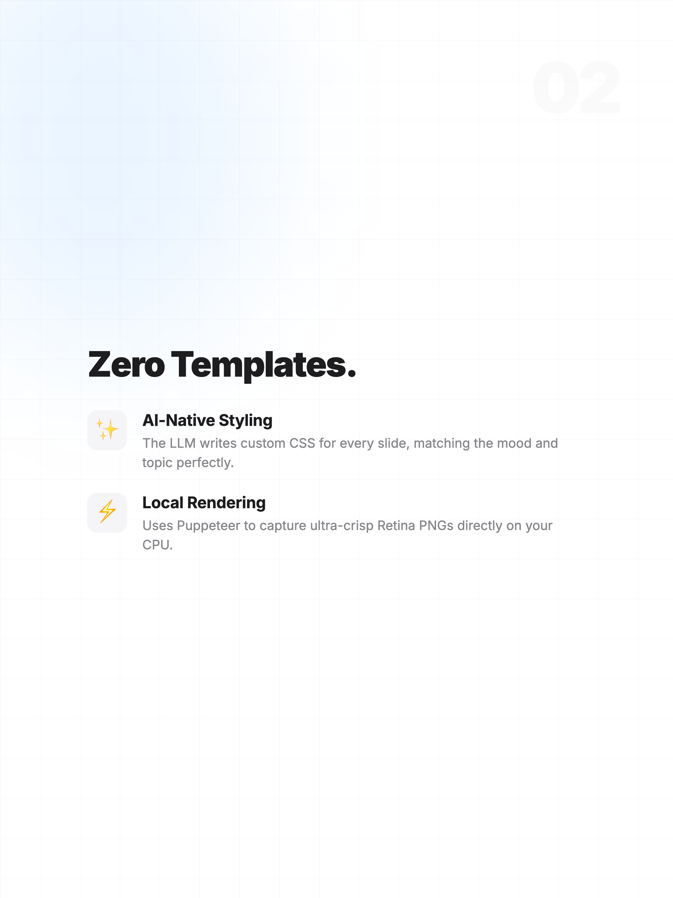

# Vibe Deck MCP Server

English | [中文说明](./README_zh.md)

**Limitless Vibe. Zero Templates.**

[](https://opensource.org/licenses/MIT)

A revolutionary Model Context Protocol (MCP) plugin that turns your local LLM (Claude/Gemini) into a top-tier visual designer for presentations, infographics, dynamic social media carousels, and elegant reports.

---

### 🌟 AI-Generated Examples

*(These images were natively rendered from HTML/CSS entirely written by the LLM itself dynamically, without any fixed templates!)*

#### Style 1: Cyberpunk / Startup Pitch (Dark Theme)
<div align="center">
  
  
  
</div>

#### Style 2: Apple Glass / Minimalist (Light Theme)
<div align="center">
  
  
</div>

---

## 🌟 Why Vibe Deck?

1. **Limitless Styles:** Want Apple Glass? Minimalist Zen? Cyberpunk? Y2K? Financial professional? Just ask the AI. It writes the CSS gradients, positioning, and typography rules in real-time.
2. **Zero-Config Intelligence:** The system prompt is **built directly into the MCP tool description**. The moment your AI loads this tool, it instantly knows how to act as an Art Director—enforcing elegant padding, perfect line-heights, dramatic typography scaling, and structured storytelling pagination.
3. **Zero Server Cost:** Uses your local machine's CPU to render via Puppeteer.

---

## 🚀 How to Install and Use

### Option 1: Direct Execution from GitHub (Recommended)
You can let `npx` fetch and run the server directly without manual git cloning.

**Add this configuration to your Claude Desktop config file:**
*(Usually located at `~/Library/Application Support/Claude/claude_desktop_config.json` on Mac)*

```json
{
  "mcpServers": {
    "vibe-deck": {
      "command": "npx",
      "args": ["-y", "github:EllenSong77/vibe-deck-mcp"]
    }
  }
}
```

### Option 2: Clone and Run Locally (For Developers)

**Step 1:** Clone the repository
```bash
git clone https://github.com/EllenSong77/vibe-deck-mcp.git
cd vibe-deck-mcp
```

**Step 2:** Install dependencies and build
```bash
npm install
npm run build
```

**Step 3:** Hook it into your MCP Client
Edit your `claude_desktop_config.json`:
```json
{
  "mcpServers": {
    "vibe-deck": {
      "command": "node",
      "args": ["/absolute/path/to/your/vibe-deck-mcp/build/index.js"]
    }
  }
}
```

---

## 🎨 Zero Configuration

**There is no `SKILL.md` to copy-paste!** 

The actual "magic" system prompt that teaches the LLM how to design beautiful HTML/CSS is injected intimately into the MCP Tool Definition itself. 
You don't need to instruct the AI manually. Just load the MCP plugin and tell Claude: *"Turn this 3000-word article about productivity into a carousel deck."*

## Tech Stack
- `@modelcontextprotocol/sdk` (MCP Server implementation)
- `puppeteer` (Headless rendering engine)
- `zod` (Robust schema validation)
- TypeScript / Node.js
