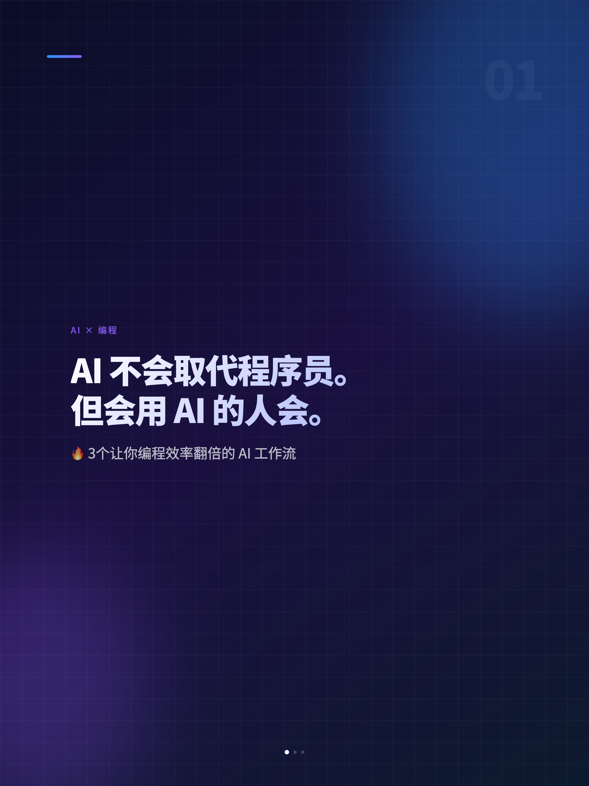
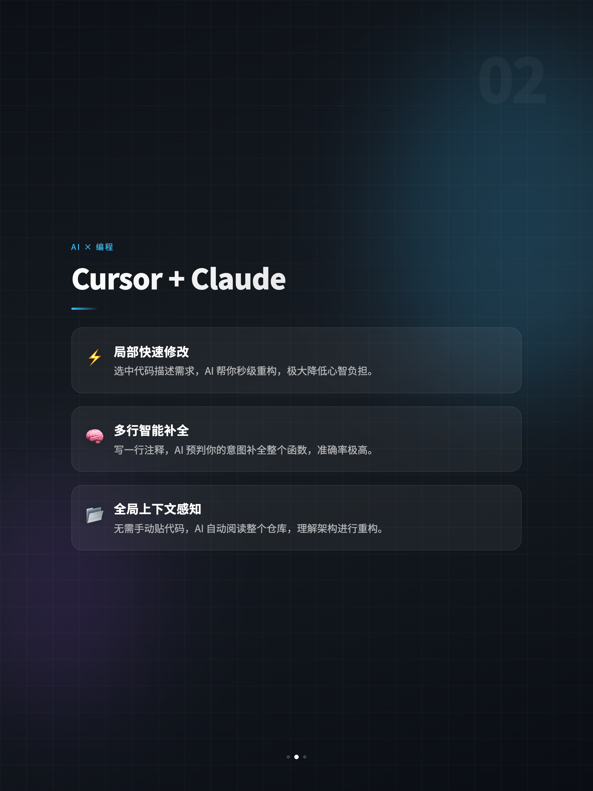
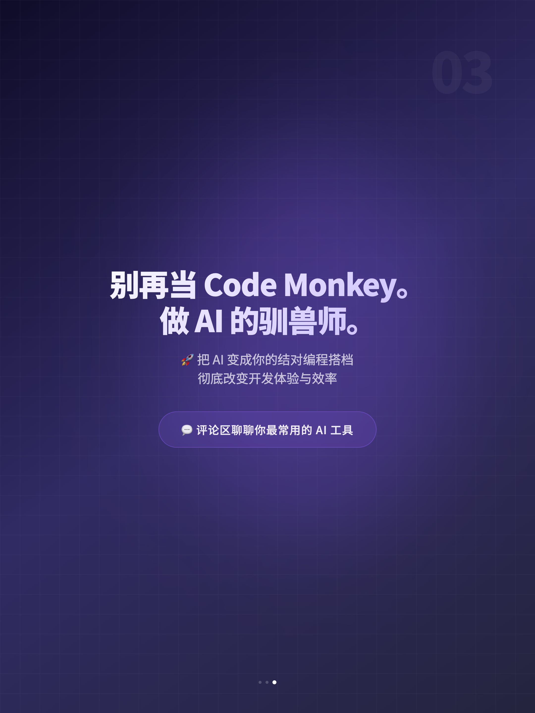

# Vibe Deck MCP Server

**Limitless Vibe. Zero Templates.** | **无尽风格，告别死板模板。**

[](https://opensource.org/licenses/MIT)

A revolutionary Model Context Protocol (MCP) plugin that turns your local LLM (Claude/Gemini) into a top-tier visual designer for presentations, infographics, dynamic social media carousels (XiaoHongShu), and elegant reports.
*(一款将你的本地大模型转化为顶级视觉设计师的零成本 MCP 插件，轻松生成小红书图文、演示文稿、数据资产和可视化卡片。)*

---

### 🌟 AI-Generated Examples (全部由大模型手写网页代码渲染生出的原创新图，无模板！)

<div align="center">
  
  
  
</div>

---

## 🌟 Why Vibe Deck? (核心优势)

1. **Limitless Styles (不受限的风格):** Want Cyberpunk? Minimalist Zen? Y2K? Financial professional? Just ask the AI. It writes the CSS gradients, positioning, and typography rules in real-time. 完全由大模型根据你的话语实时生成前沿的 CSS。
2. **True Design Intelligence (真正的设计大脑):** The provided `SKILL.md` (System Prompt) trains the AI to act as an Art Director—enforcing elegant padding, perfect line-heights, dramatic typography scaling, and structured storytelling pagination (Cover → Problem → Detail → CTA). 提示词级控制，锁死了优雅的留白、行间距，确保不会出现“大白纸小干字”。
3. **Zero Server Cost (零服务器成本):** Uses your local machine's CPU to render via Puppeteer. 借助你本地电脑的算力，通过无头浏览器直接将代码渲染成高清图片。

---

## 🚀 How to Install and Use (安装指南)

### Option 1: Direct Execution from GitHub (Recommended / 推荐)
You can let `npx` fetch and run the server directly without manual git cloning.

**Add this configuration to your Claude Desktop config file:**
*(Usually located at `~/Library/Application Support/Claude/claude_desktop_config.json` on Mac)*

```json
{
  "mcpServers": {
    "vibe-deck": {
      "command": "npx",
      "args": ["-y", "github:EllenSong77/vibe-deck-mcp"]
    }
  }
}
```

### Option 2: Clone and Run Locally (For Developers / 本地纯源代码运行)

**Step 1:** Clone the repository
```bash
git clone https://github.com/EllenSong77/vibe-deck-mcp.git
cd vibe-deck-mcp
```

**Step 2:** Install dependencies and build
```bash
npm install
npm run build
```

**Step 3:** Hook it into your MCP Client
Edit your `claude_desktop_config.json`:
```json
{
  "mcpServers": {
    "vibe-deck": {
      "command": "node",
      "args": ["/absolute/path/to/your/vibe-deck-mcp/build/index.js"]
    }
  }
}
```

---

## 🎨 The Secret Sauce: `SKILL.md` (绝密调教指南)

The MCP server itself is just a highly efficient HTML-to-PNG engine. The actual "magic" lives in the [SKILL.md](./SKILL.md) file.

**You MUST feed the contents of `SKILL.md` to Claude/Gemini (either via a custom instruction, a project knowledge base, or directly in the chat) before asking it to generate a deck.** This teaches the AI the strict typography, layout limits, and CSS decoration techniques required to make the cards look gorgeous rather than just "text on a white background".

*(这个 MCP 插件本身只是一个“浏览器黑盒截图机”，真正赋予大模型顶级设计师灵魂的是根目录的 `SKILL.md`。在使用本插件前，请务必把 `SKILL.md` 里的长文本发给大模型阅读，或者配置在 Project 的 Knowledge 中。)*

## Tech Stack
- `@modelcontextprotocol/sdk` (MCP Server implementation)
- `puppeteer` (Headless rendering engine)
- `zod` (Robust schema validation)
- TypeScript / Node.js
